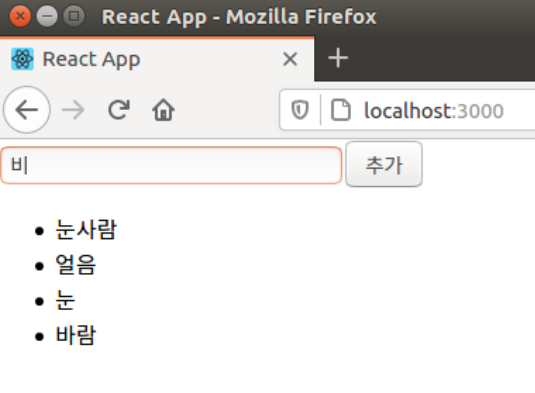

```react
import React, { useState } from 'react';

const IterationSample = () => {
    const [names, setNames] = useState([
        { id: 1, text: '눈사람' },
        { id: 2, text: '얼음' },
        { id: 3, text: '눈' },
        { id: 4, text: '바람' } 
    ]);
    const [inputText, setInputText] = useState('');
    const [nextId, setNextId] = useState(5); // 새로운 항목을 추가할 때 사용할 id
    
    const onChange = e => setInputText(e.target.value);
    const onClick = () => {
        const nextNames = names.concat({
            id: nextId,
            text: inputText
        });
        setNextId(nextId + 1); //nextId 값에 1 더해주기
        setNames(nextNames); // names 값 업데이트
        setInputText(''); // 기존 inputText(input 내용) 비우기
    }
    
    const namesList = names.map(name => <li key={name.id}>{name.text}</li>);
    return (
        <>
          <input value={inputText} onChange={onChange} />
          <button onClick={onClick}>추가</button>
          <ul>{namesList}</ul>
       </>
   );
};

export default IterationSample;
```

```
배열에 새 항목을 추가할 때 push 함수를 사용하지 않고 concat을 사용했는데,

push는 기존 배열 자체를 변경해주는 반면 concat은 새로운 배열을 만들어 준다는 차이가 있다.

리액트에서 상태를 업데이트할 때는 기존 상태를 그대로 두면서 새로운 값을 상태로 설정해야한다.

불변성 유지해줘야 나중에 리액트 컴포넌트의 성능을 최적화할 수 있다.
```



